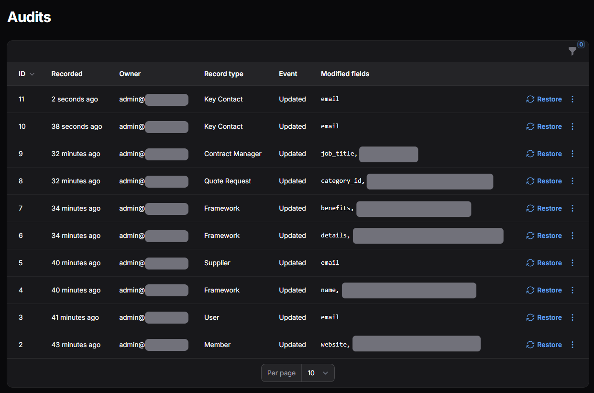
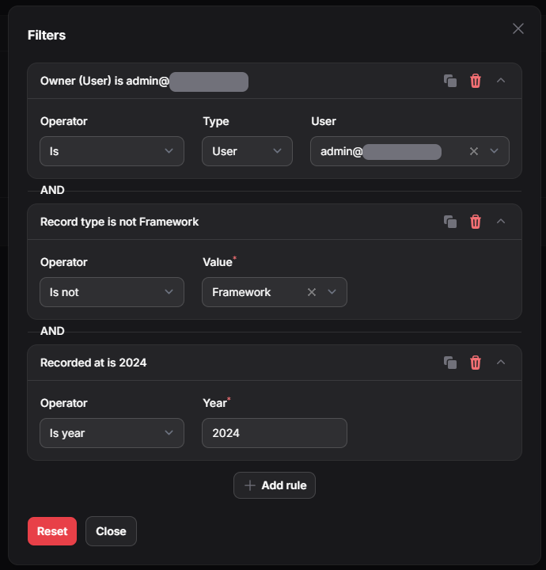
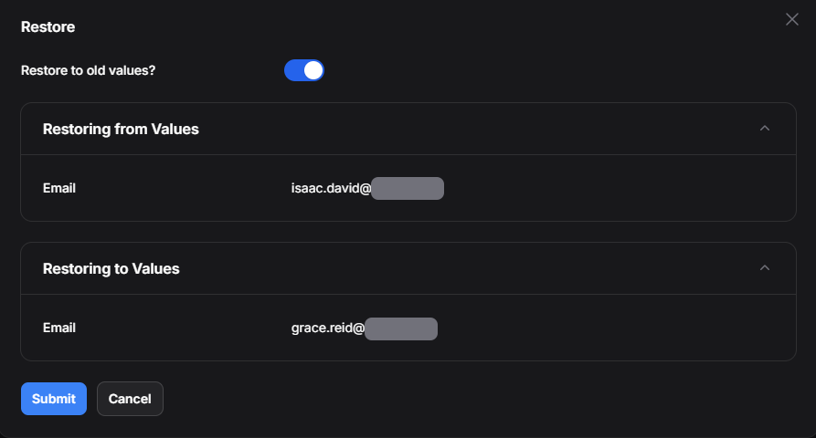

# Auditing for Filament


[](https://packagist.org/packages/crescent-purchasing/filament-auditing)
[](https://github.com/crescent-purchasing/filament-auditing/actions?query=workflow%3Arun-tests+branch%3Amain)
[](https://github.com/crescent-purchasing/filament-auditing/actions?query=workflow%3A"Fix+PHP+code+styling"+branch%3Amain)
[](https://packagist.org/packages/crescent-purchasing/filament-auditing)

View and manage Audit History for your Laravel Models in Filament.
Built upon the [Laravel Auditing package by OwenIT](https://laravel-auditing.com/).

## Screenshots

### Audit Overview


### Viewing Audits


### Filtering Audits


### Restoring Audits


## Features

### Audit Resource
- View all Audits for all Resources within Filament
- Filter using a Query Builder
- View the audited record as well as the user who triggered the audit
- Uses cursor pagination by default for a performance boost

### Relation Managers
- View the audits of a specific record to see when it was changed
- View the audits of a user to see what records they have changed see [Owned Audits](#owned-audits)

### Restoration
- Restore audits to previous points in their history
- Simple configuration for managing permission to perform a restoration

## Installation

### Prerequisites

This package requires the latest major version of Laravel Auditing, v14.

It'll be installed automatically, but it's recommended to install Laravel Auditing in your own repository.

Make sure to follow the [installation instructions](https://laravel-auditing.com/guide/installation.html).
It's recommended to give the [full documentation](https://laravel-auditing.com/guide/introduction.html) a read, too.

```bash
composer require owen-it/laravel-auditing
```

Namely, make sure you publish the migration and configuration:

```bash
php artisan vendor:publish --provider "OwenIt\Auditing\AuditingServiceProvider" --tag="config"
```

```bash
php artisan vendor:publish --provider "OwenIt\Auditing\AuditingServiceProvider" --tag="migrations"
php artisan migrate
```

### Install

You can then install this package via composer:

```bash
composer require crescent-purchasing/filament-auditing
```

## Usage

To use this plugin within your panel, add it to your `plugins()` section in your `PanelProvider`:

```php
use CrescentPurchasing\FilamentAuditing\FilamentAuditingPlugin;
use Filament\Panel;
use Filament\PanelProvider;

class AuditPanelProvider extends PanelProvider
{
    public function panel(Panel $panel): Panel
    {
        return $panel
            ->default()
            ->id('admin')
            // ...
            ->plugins([
                FilamentAuditingPlugin::make(),
            ]);
    }
}
```

This will automatically add the Resource Page to your Filament Panel.
It should also provide some basic configuration that will work for most use-cases.

### Relation Manager

The plugin allows you to view the audit history of a specific record.
To do so, simply add the Relation Manager to the resource:

```php
use CrescentPurchasing\FilamentAuditing\Filament\RelationManagers\AuditsRelationManager;

public static function getRelations(): array
{
    return [
        AuditsRelationManager::class,
    ];
}
```

### Owned Audits

The plugin comes with the `OwnedAuditsRelationManager`. This by default doesn't have support with Laravel Auditing.
However, it's easy to add the support. Simply add a relation function like the following to each of your User Models:

```php
use Illuminate\Database\Eloquent\Relations\MorphMany;
use OwenIt\Auditing\Models\Audit;

/**
 * @return MorphMany<Audit, $this>
 */
public function ownedAudits(): MorphMany
{
    return $this->morphMany(Audit::class, 'user');
}
```

Then, add the relation manager to your Resources as normal:


```php
use CrescentPurchasing\FilamentAuditing\Filament\RelationManagers\OwnedAuditsRelationManager;

public static function getRelations(): array
{
    return [
        OwnedAuditsRelationManager::class,
    ];
}
```

## Configuration

You can configure a few parts of the application.

### Cursor Pagination

Cursor Pagination for Audits is enabled by default. You can disable this using `cursorPagination()`:

```php
use CrescentPurchasing\FilamentAuditing\FilamentAuditingPlugin;

FilamentAuditingPlugin::make()
    ->cursorPagination(false)
```

### Audit Model

By default, the configured `audit.implementation` config value is used for the Audit Model.
This can be modified using `model()`

```php
use CrescentPurchasing\FilamentAuditing\FilamentAuditingPlugin;

FilamentAuditingPlugin::make()
    ->model(\OwenIt\Auditing\Models\Audit::class)
```

### Formatting Auditable Type

The Auditable Type in tables is formatted as a Headline of the Class Basename.
You can customise this using a closure within `formatAuditableTypeUsing()`:

```php
use CrescentPurchasing\FilamentAuditing\FilamentAuditingPlugin;

FilamentAuditingPlugin::make()
    ->formatAuditableTypeUsing(fn(string $value): string => strtoupper($value))
```

### Formatting Event Name

The event names are turned into a Headline. You can customise this using `formatEventUsing()`:

```php
use CrescentPurchasing\FilamentAuditing\FilamentAuditingPlugin;

FilamentAuditingPlugin::make()
    ->formatEventUsing(fn(string $value): string => strtoupper($value))
```

### Navigation Group

No Navigation Group for the Resource is set by default. You can set this using `navigationGroup()`:

```php
use CrescentPurchasing\FilamentAuditing\FilamentAuditingPlugin;

FilamentAuditingPlugin::make()
    ->navigationGroup('Administration')
```

### Navigation Icon

The Resource icon by default is `heroicon-o-clock`. You can set this using `navigationIcon()`:

```php
use CrescentPurchasing\FilamentAuditing\FilamentAuditingPlugin;

FilamentAuditingPlugin::make()
    ->navigationIcon('heroicon-o-check')
```

### Restore Permission

The permission used for Audit restoration is `restoreAudit` by default. You can set this using `restorePermission()`

```php
use CrescentPurchasing\FilamentAuditing\FilamentAuditingPlugin;

FilamentAuditingPlugin::make()
    ->restorePermission('goToOldAudit')
```

### Users

The default list of User classes is determined using the `audit.user.guards` config value.
This then checks the list of auth providers in `auth.providers`.
You can change this behaviour with `users()`:

```php
use CrescentPurchasing\FilamentAuditing\FilamentAuditingPlugin;

FilamentAuditingPlugin::make()
    ->users([\CrescentPurchasing\FilamentAuditing\Tests\Models\User::class])
```

### User Table Schema

By default, viewing user information of an Audit only displays 2 columns: `email` and `id`.
You can specify additional columns with `userSchema`:

```php
use CrescentPurchasing\FilamentAuditing\FilamentAuditingPlugin;
use Filament\Forms\Components\TextInput;

FilamentAuditingPlugin::make()
    ->userSchema([
        TextInput::make('first_name'),
        TextInput::make('last_name'),
    ])
```

## Testing

```bash
composer test
```

## Changelog

Please see [CHANGELOG](CHANGELOG.md) for more information on what has changed recently.

## Contributing

Please see [CONTRIBUTING](.github/CONTRIBUTING.md) for details.

## Security Vulnerabilities

Please review [our security policy](https://github.com/crescent-purchasing/filament-auditing/security/policy) on how to report security vulnerabilities.

## Credits

- [Crescent Purchasing .Ltd](https://github.com/crescent-purchasing)
- [Robert Lyons](https://github.com/aSeriousDeveloper)
- [All Contributors](https://github.com/crescent-purchasing/filament-auditing/contributors)

## License

The MIT License (MIT). Please see [License File](LICENSE.md) for more information.
